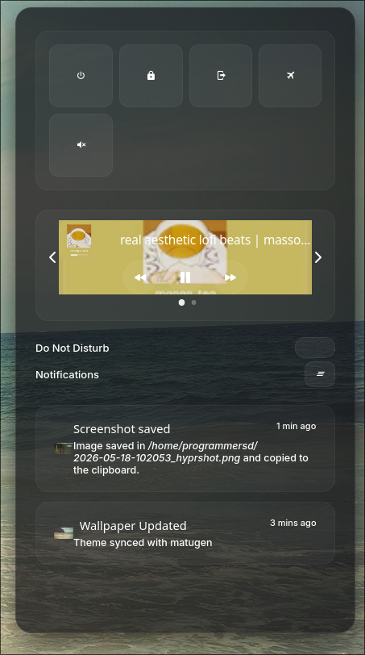

<p align="center">
  
</p>

<h1 align="center">velvet noir.</h1>
<p align="center">
  an elegant, dynamic, dark-glass hyprland workspace.<br>
  managed with chezmoi. real-time color generation by matugen.
</p>

<p align="center">
  <a href="#about">about</a> •
  <a href="#features">features</a> •
  <a href="#gallery">gallery</a> •
  <a href="#keybinds">keybinds</a> •
  <a href="#installation">installation</a>
</p>

<br>

## about

velvet noir is a deeply integrated, highly polished desktop environment built on wayland. it relies on matugen to extract colors from your current wallpaper and instantly injects them into every component of the system. no restarts, no logouts. 

everything from the terminal prompt to the notification center repaints dynamically, producing a cohesive, premium aesthetic.

## features

* **hyprland** — dwindle tiling, custom elastic bezier curves (whoosh-zap transitions), 4-pass frosted blur, and smooth workspace gestures.
* **waybar** — 44px top bar. floating pills with solid matugen backgrounds, debossed text, and embossed shadows.
* **rofi** — dynamic, expanding listview with snappy pop-in transitions. includes a visual grid-based wallpaper picker.
* **kitty & starship** — glass-blurred terminal (85% opacity) with a tokyo night-inspired dynamic block prompt using powerline arrows.
* **ecosystem** — fully themed swaync (notifications), yazi (files), btop (monitor), wlogout (power), and cava (visualizer).

## gallery

<p align="center">
  
  
</p>
<p align="center">
  
  
</p>
<p align="center">
  
  
</p>

## window rules

* `kitty`, `firefox`, `zen`, `code`, `discord`, `thunar` — custom opacity parameters with glass blur effects.
* `pavucontrol`, `blueman`, file dialogs — automatically float and center perfectly.
* `picture-in-picture` — floats and pins to all workspaces.

## keybinds

```text
super + enter           open terminal
super + space           open launcher
super + q               close focused window
super + f               toggle fullscreen
super + v               toggle float
super + l               open power menu
super + ctrl + l        lock screen

super + w               open wallpaper picker
super + e               open file manager
super + d               open discord

super + h/j/k/l         focus left/down/up/right
super + shift + h/j/k/l move window
super + ctrl + h/j/k/l  resize active window (±40px)
super + 1–9             switch to workspace
super + shift + 1–9     send window to workspace

print                   screenshot (full screen)
super + shift + s       screenshot (select region)
super + ctrl + s        screenshot (focused window)

3-finger swipe          switch workspace left/right
super + scroll          cycle through workspaces
```

## installation

velvet noir features a fully automated, non-interactive installer script that deploys dependencies, configurations, and bootstraps the initial color palette.

```bash
# clone the repository and run the installer
git clone https://github.com/programmersd21/velvet.git
cd velvet
chmod +x install.sh
./install.sh
```

or install manually using chezmoi:

```bash
sh -c "$(curl -fsLS get.chezmoi.io)"
chezmoi init --apply https://github.com/programmersd21/velvet.git
```

### post-installation

if installing manually, you can initialize the dynamic color scheme by placing a wallpaper at `~/.config/wallpapers/others/default.jpg` and running the theme switcher:

```bash
~/.config/scripts/theme-switch.sh ~/.config/wallpapers/others/default.jpg
```

this commands the matugen engine to generate all color files, ensuring every component renders perfectly on first boot.

### dependencies
```text
hyprland waybar rofi-wayland kitty swaync matugen swww starship fastfetch cava btop yazi wlogout hyprshot hyprlock hypridle brightnessctl playerctl wpctl nm-applet blueman polkit-gnome
```

### aesthetics
* **fonts** — jetbrainsmono nerd font, inter
* **gtk** — adw-gtk3-dark, papirus-dark, bibata-modern-classic

<br>

<p align="center"><sub>velvet noir · <a href="https://github.com/programmersd21">github</a></sub></p>
