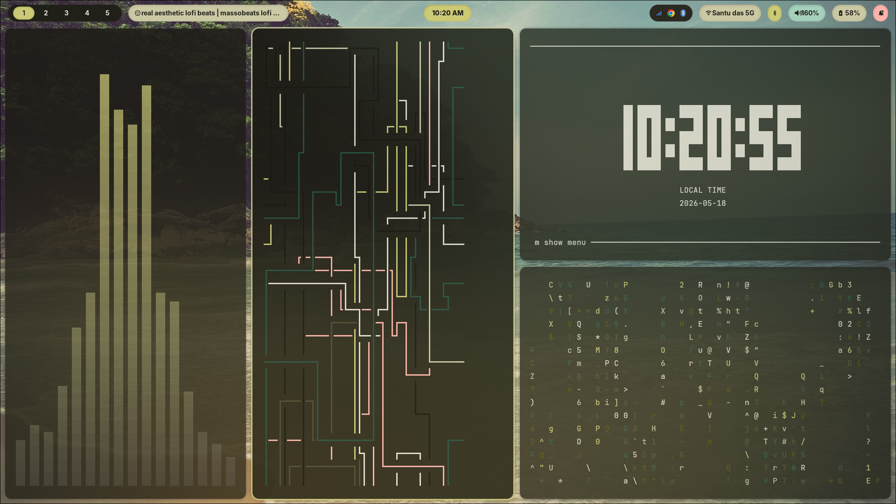
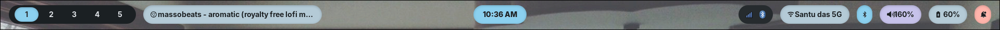
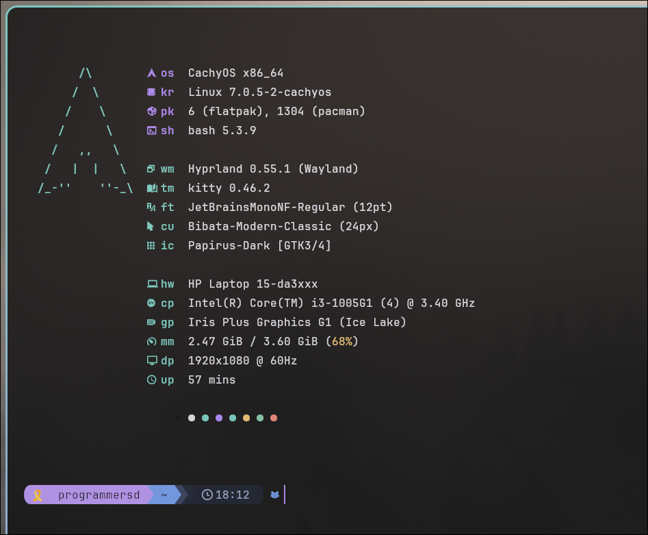
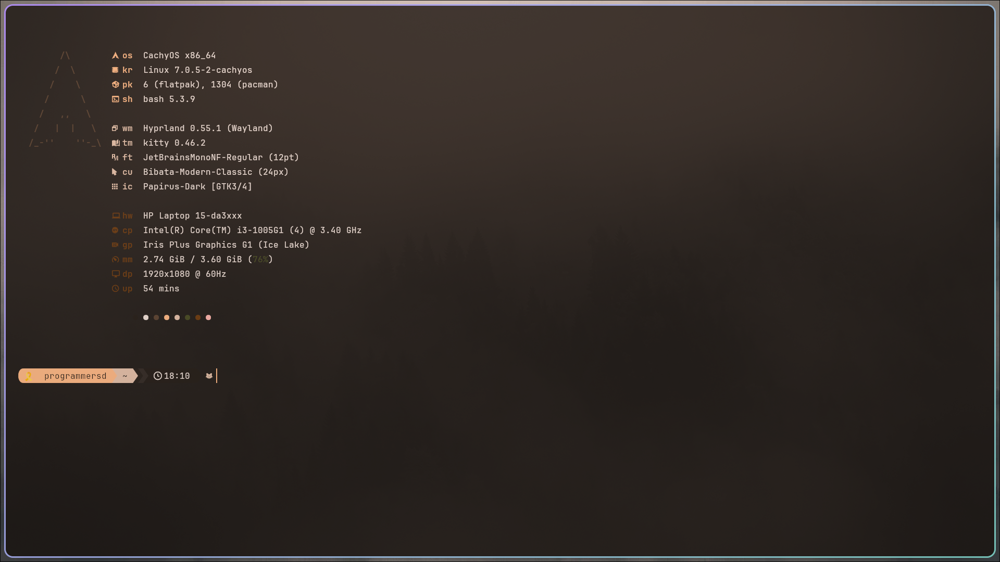
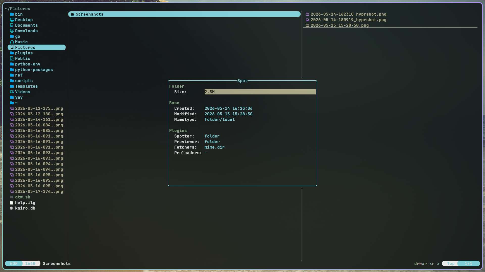
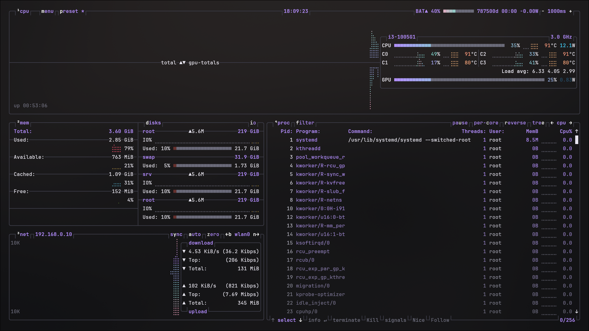

<p align="center">
  
</p>

<h3 align="center">velvet noir</h3>
<p align="center">hyprland · matugen · chezmoi</p>

<p align="center">
  <a href="#about">about</a> · 
  <a href="#details">details</a> · 
  <a href="#keybinds">keybinds</a> · 
  <a href="#install">install</a>
</p>

---

### about

a dark, glass-forward hyprland rice that adapts to your wallpaper.

pick a wallpaper → matugen extracts a color palette → every surface on the desktop updates live. no logout, no restart. waybar, rofi, kitty, swaync, cava, btop, starship, and discord all follow the same palette automatically.

managed with chezmoi so the same dotfiles work across machines.

---

### details

**compositor** — hyprland with dwindle tiling. 4px inner gaps, 8px outer gaps, 14px rounded corners, 3px gradient borders that loop slowly. 4-pass blur with low noise. custom bezier curves for every animation type. v0.51.0 gesture syntax for 3-finger workspace swiping.

**bar** — waybar at 38px. three floating pill islands with solid, opaque matugen-palette backgrounds. debossed text with embossed shadows for depth. icon-only workspaces (terminal, browser, chat, code, music). 24h clock in the center. icon-only network and bluetooth with details in tooltips. subtle lift animation on hover.

<p align="center">
  
</p>

**launcher** — rofi with a custom velvet theme. 640px wide, 8 visible entries, top accent border. includes a grid-based wallpaper picker (`super+w`) that previews images, sets them via swww with a grow transition, and triggers matugen to regenerate all colors.

**terminal** — kitty at 85% opacity with compositor blur (64). beam cursor with trail. jetbrainsmono nerd font at 12pt with 125% line height. 12px vertical / 16px horizontal padding. separator-style tab bar.

**prompt** — starship with a clean two-line layout. directory and git info on line one, `❯` on line two. no powerline arrows, no background segments. just colored text with nerd font icons.

<p align="center">
  
  <br>
  <sub>fastfetch with dynamic matugen hex circles and starship prompt</sub>
</p>

<p align="center">
  
  <br>
  <sub>terminal detail — CachyOS fastfetch and starship prompt</sub>
</p>

**notifications** — swaync with a glass control center. buttons grid, mpris widget, do not disturb toggle, and scrollable notification list.

**visualizer** — cava with a 4-color gradient across the palette (violet → teal → rose → gold). monstercat smoothing at 75fps.

**power menu** — wlogout with 6 glass buttons (lock, hibernate, suspend, logout, reboot, shutdown). each button has its own hover glow color matching its action severity.

**file manager** — yazi with velvet noir colors, vi keybinds, sorted by modified time.

<p align="center">
  
  <br>
  <sub>yazi file manager</sub>
</p>

**system monitor** — btop with velvet noir theme, full hardware overview.

<p align="center">
  
  <br>
  <sub>btop system monitor</sub>
</p>

**discord** — vesktop with custom css that flattens the ui into the velvet noir palette. slim 4px scrollbars, rounded inputs, accent-colored badges.

---

### window rules

```
kitty               0.88 opacity   tiled
firefox / zen       0.97 opacity   tiled        → workspace 2
vesktop / discord   0.94 opacity                → workspace 3
code                0.96 opacity   tiled
thunar              0.90 opacity

pavucontrol         float   centered   680×520
blueman             float   centered   620×480
file dialogs        float   centered   900×600
picture-in-picture  float   pinned     480×270
```

---

### keybinds

```
super + enter           terminal
super + space           launcher
super + q               close window
super + f               fullscreen
super + v               toggle float
super + l               wlogout
super + ctrl + l        hyprlock

super + w               wallpaper picker
super + e               file manager
super + d               discord

super + h/j/k / arrows  focus left/down/up/right
super + shift + h/j/k/l move window
super + ctrl + h/j/k/l  resize ±40px
super + 1–9             workspace
super + shift + 1–9     send to workspace

print                   screenshot (screen)
super + shift + s       screenshot (region)
super + ctrl + s        screenshot (window)

3-finger swipe          workspace left/right
super + scroll           cycle workspaces
```

---

### install

you can install the entire stack, dependencies, and configuration automatically using the interactive installer:

```bash
# clone and run the installer
git clone https://github.com/programmersd21/velvet.git
cd velvet
chmod +x install.sh
./install.sh
```

or manually using chezmoi if you prefer:

```bash
sh -c "$(curl -fsLS get.chezmoi.io)"
chezmoi init --apply https://github.com/programmersd21/velvet.git
```

if installing manually, create `~/.local/share/chezmoi/.chezmoidata.yaml` with your display info for the monitor template to resolve:

```yaml
machine:
  monitor_name: "eDP-1"
  monitor_res: "1920x1080"
  monitor_rate: "60"
  is_laptop: true
```

place a wallpaper at `~/.config/wallpapers/others/default.jpg` and run:

```bash
~/.config/scripts/theme-switch.sh ~/.config/wallpapers/others/default.jpg
```

this generates all color files so every component renders correctly on first boot.

#### dependencies

```
hyprland waybar rofi-wayland kitty swaync matugen swww starship
fastfetch cava btop yazi wlogout hyprshot hyprlock hypridle
brightnessctl playerctl wpctl nm-applet blueman polkit-gnome
```

**fonts** — jetbrainsmono nerd font, inter  
**gtk** — adw-gtk3-dark, papirus-dark, bibata-modern-classic

---

### structure

```
hypr/
  hyprland.conf       main config, palette fallbacks, source ordering
  colors.conf         matugen-generated color variables
  animations.conf     named bezier curves, per-type timing
  keybinds.conf       super-based vi-style bindings
  windowrules.conf    glass opacity, floating, workspace assignments
  autostart.conf      wallpaper → theme → bar → applets
  env.conf            wayland, gtk, qt, nvidia environment
  monitors.conf.tmpl  chezmoi template for display settings

waybar/
  config.jsonc        38px island bar, icon workspaces, tooltip-rich
  style.css           solid pill islands, debossed text, matugen colors

rofi/
  config.rasi         drun / run / filebrowser, inter medium 12
  velvet.rasi         640px launcher with top accent border
  wallpaper-picker    grid preview → swww + matugen

kitty/
  kitty.conf          glass, blur, beam cursor, separator tabs
  velvet-theme.conf   16-color ansi palette

matugen/
  config.toml         8 template outputs with post-hooks
  templates/          color templates for every surface

starship.toml         two-line prompt, no arrows, ❯ char
cava/config           4-color gradient, monstercat
fastfetch/            minimal 3-section layout, color circles
swaync/               glass notification center
wlogout/              glass power menu with icon buttons
btop/                 velvet noir theme
vesktop/              discord css override
yazi/                 velvet themed file manager
scripts/              theme-switch.sh (wallpaper + reload all)
```

---

<p align="center"><sub>soumalya · <a href="https://github.com/programmersd21">github</a></sub></p>
